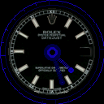

<link rel="stylesheet" href="assets/css/main.css">

# Wemos  S3_MINI_PRO  ESPHome

<a href="https://www.wemos.cc/en/latest/s3/s3_mini_pro.html">Wemos S3_MINI_PRO</a> full feature implementation for ESPHome

##  S3 Mini Pro S3 

<sup>Compatible with <code>arduino</code> and <code>esp-idf</code></sup>


## Installation

> [!TIP]
> You can use the button below to install the pre-built firmware directly to your device via USB from the browser.

<center>

<esp-web-install-button manifest="./manifest.json"></esp-web-install-button>

<script type="module" src="https://unpkg.com/esp-web-tools@9/dist/web/install-button.js?module"></script>

</center>


## Support the author

> [!NOTE]
> Achieving a sponsorship goal will make me happy

<iframe src="https://github.com/sponsors/velijv/card" title="Sponsor velijv" height="225" width="600"></iframe>


## Specs

<details>
<summary>Technical details 🧑‍💻 + <a href="datasheets">datasheets 📚 </a></summary>

### **ESP32-S3FH4R2**
Espressif Systems ESP32-S3 (QFN56) (revision v0.2) dual-core Tensilica LX7 @ up to 240 MHz with vector instructions for AI acceleration

> * **0.85” 128x128 LCD TFT display (GC9107/GC9A01)**
> * **6D MEMS IMU (QMI8658C)**
> * 1x RGB LED (Data: IO8, Power: IO7)
> * 1x IR (IO9)
> * SH1.0-4P I2C Port
> > * Bluetooth: BLE V5.0
> > * Embedded Flash 4MB (XMC)
> > * Embedded PSRAM 2MB (AP_3v3)
> > * ADC, DAC, I2C, SPI, UART, USB OTG


</details>


## Result

<table>
	<thead>
		<tr>
			<th>
			
			</th>
			<th>
				
				
			</th>
			<th>
				<a href="https://veli.ee/sponsor">
					
				</a>
				</th>
		</tr>
	</thead>
	<tbody>
	<tr>
		<td>  </td>
		<td>  </td>
		<td>  </td>
	</tr>
	</tbody>
</table>


## Features

> [!TIP]
> Use all the devices capabilities that hardware provides.

### <code>sensor</code>
<details>
  <summary> 🎛 (QMI8658C) 6D MEMS IMU <code>yaml</code> 👇 </summary>

***

```yaml
external_components:
  - source: components
    components: [ qmi ]

sensor:
  - platform: qmi
    address: 0x6B
    update_interval: ${update_interval}
    temperature:
      name: ${gyro_name} Internal Temperature
      id: ${gyro_id}_temperature
      accuracy_decimals: 1
    acceleration_x:
      name: ${gyro_name} Accel X
      id: ${gyro_id}_accel_x
    acceleration_y:
      name: ${gyro_name} Accel y
      id: ${gyro_id}_accel_y
    acceleration_z:
      name: ${gyro_name} Accel Z
      id: ${gyro_id}_accel_z
    gyro_x:
      name: ${gyro_name} Gyro X
      id: ${gyro_id}_gyro_x
    gyro_y:
      name: ${gyro_name} Gyro Y
      id: ${gyro_id}_gyro_y
    gyro_z:
      name: ${gyro_name} Gyro Z
      id: ${gyro_id}_gyro_z
    yaw:
      name: ${gyro_name} Yaw
      id: ${gyro_id}_yaw
    pitch:
      name: ${gyro_name} Pitch
      id: ${gyro_id}_pitch
    roll:
      name: ${gyro_name} Roll
      id: ${gyro_id}_roll
    gforce_x:
      id: ${gyro_id}_gforce_x
      name: ${gyro_name} G-Force X
      accuracy_decimals: 1
    gforce_y:
      id: ${gyro_id}_gforce_y
      name: ${gyro_name} G-Force Y
    gforce_z:
      id: ${gyro_id}_gforce_z
      name: ${gyro_name} G-Force Z
```


</details>


<table>
	<tr>
		<td></td>
		<td></td>
		<td></td>
	</tr>
</table>


### <code>display</code>
<details open>
  <summary> 📺 (GC9107/GC9A01) 0.85” 128x128 LCD TFT display <code>yaml</code> 👇 </summary>

***

```yaml
display:
    platform: ili9xxx
    cs_pin: $pin_tft_cs
    dc_pin: $pin_tft_dc
    reset_pin: $pin_tft_rst
    update_interval: $display_update_interval
    auto_clear_enabled: true
    model: GC9A01A
    dimensions:
      height: $display_height
      width: $display_width
      offset_height: 1
      offset_width: 2
    data_rate: 20MHz
    color_order: bgr
    invert_colors: true
    transform:
      mirror_x: true
      mirror_y: true
```

</details>


<table>
	<tr>
		<td></td>
		<td></td>
		<td></td>
    <td></td>
    <td></td>
	</tr>
<table>


### <code>remote_receiver</code>
<details open>
  <summary> 🟣 (IR-0602) Infrared <code>yaml</code> 👇 </summary>

***

```yaml
remote_receiver:
  rmt_channel: 5
  dump: all
  pin:
    number: $pin_ir
    mode:
      input: true
      pullup: true
  tolerance: 20%
  buffer_size: 20kb
```

</details>


### <code>light</code> & <code>power_supply</code>
<details open>
  <summary> 🌈 RGB LED with 🔌 Power Supply  <code>yaml</code> 👇 </summary>

***

```yaml
power_supply:
- id: rgb_led_psu
  pin:
    number: $pin_rgb_power
    mode:
      output: true
      pulldown: true
  enable_time: 10ms
  keep_on_time: 50ms
  enable_on_boot: false

light:
  - platform: esp32_rmt_led_strip
    rmt_channel: 3
    chipset: WS2812
    rgb_order: RGB
    pin: $pin_rgb_led
    num_leds: 1
    icon: mdi:developer-board
    id: ${device_name}_leds
    name: IO_${pin_rgb_led}_LED
    restore_mode: ALWAYS_OFF
    default_transition_length: 200ms
    power_supply: rgb_led_psu
```

</details>


***


<table>
	<tr>
		<td>
		<td></td>
		<td></td>
	</tr>
</table>


***


## Disclaimer
> <sub>All product names, logos, and brands are property of their respective owners. All company, product and service names used are for identification purposes only. Use of these names, logos, and brands does not imply endorsement. </sub>
>
> > To release the full source, I would like to achieve a sponsorship goal.
> >
> > [&color=rgba(234,74,170,0.5) "for jsut 1 doolar you can lead a por man to fish")](https://github.com/sponsors/velijv) [&color=rgba(128,128,1,0.1)&style=flat-square "help me replace my blown up devices")](https://www.buymeacoffee.com/velijv) [&color=rgba(1,33,105,0.1) "Purchase new gadgets to hack for you")](https://paypal.me/velijohan) [&color=rgba(124,124,124,0.1) "Read about me and more ways to Sponsor")](https://veli.ee/sponsor)
>
> [&labelColor=rgba(231,53,44,0)&style=flat-square&color=rgba(231,53,44,0.1))](https://creativecommons.org/licenses/by-nc/4.0/ "LILYGO® T-Watch S3 ESPHome © 2024 by Veli-Johan Veromann is licensed under Attribution-NonCommercial-NoDerivatives 4.0 International") [&color=rgba(245,160,18,0.1)&style=flat-square
)](https://github.com/search?q=wemos) [&color=rgba(231,53,44,0.1)&style=flat-square
)](https://github.com/espressif/) [![ESPHome](https://img.shields.io/badge/ESPHome-000?logo=data%3Aimage%2Fsvg%2Bxml%3Bbase64%2CPHN2ZyB4bWxucz0iaHR0cDovL3d3dy53My5vcmcvMjAwMC9zdmciIGZpbGw9Im5vbmUiIHZpZXdCb3g9IjAgMCA1MTIgNTEyIj4KICA8ZGVmcz4KICAgIDxwYXRoIGlkPSJyZXVzZS0wIiBmaWxsLXJ1bGU9Im5vbnplcm8iIGQ9Ik00MC41IDM4LjMyaDIuODd2Ny43NWgxNy4yNXYtNy43NWgyLjg3bC0yLjg5LTIuOXYtNS4wN2gtMS44djMuMjhsLTYuODEtNi44MXoiIGNsYXNzPSJmaWxsLWJsYWNrIi8+CiAgICA8c3R5bGU+CiAgICBwYXRoe2NvbG9yOiMxZDIxMjY7ZmlsbDpjdXJyZW50Q29sb3I7c3Ryb2tlOmN1cnJlbnRDb2xvcjtzdHJva2UtbGluZWNhcDpyb3VuZDtzdHJva2UtbGluZWpvaW46cm91bmR9CiAgICBAbWVkaWEocHJlZmVycy1jb2xvci1zY2hlbWU6ZGFyaykge3BhdGh7Y29sb3I6I0YyRjRGOX19CiAgICA8L3N0eWxlPgogIDwvZGVmcz4KCiAgPGcgY2xpcC1wYXRoPSJ1cmwoI2EpIj4KICAgIDxwYXRoIGQ9Ik0zNzMgMjM5IDI2NyAxMzRjLTYtNy0xNi03LTIyIDBMMTM5IDIzOWMtNiA2LTExIDE4LTExIDI3djk2YzAgOSA3IDE2IDE2IDE2aDYzVjIxOWMwLTQgMy02IDYtNmg4NmMzIDAgNiAyIDYgNnYyNmMwIDMtMyA2LTYgNmgtNTR2MTNoNTRjMyAwIDYgMyA2IDZ2MjZjMCAzLTMgNi02IDZoLTU0djEzaDU0YzMgMCA2IDMgNiA2djI2YzAgMy0zIDYtNiA2aC02MGE2IDYgMCAxIDEgMC0xMmg1M3YtMTNoLTUzYy00IDAtNi0zLTYtN3YtMjVjMC00IDItNyA2LTdoNTN2LTEyaC01M2MtNCAwLTYtMy02LTd2LTI1YzAtNCAyLTcgNi03aDUzdi0xM2gtNzJ2MTUzaDE0OGM5IDAgMTYtNyAxNi0xNnYtOTZjMC05LTUtMjEtMTEtMjdaIi8+CiAgPC9nPgogIDxkZWZzPgogICAgPGNsaXBQYXRoIGlkPSJhIj4KICAgICAgPHBhdGggZmlsbD0iI2ZmZiIgZD0iTTEyOCAxMjloMjU2djI1NkgxMjh6Ii8+CiAgICA8L2NsaXBQYXRoPgogIDwvZGVmcz4KPC9zdmc+Cg==&logoColor=808080&labelColor=rgba(0,0,0,0)&color=rgba(33,33,33,0.1)&style=flat-square)](https://github.com/esphome/esphome) [&color=rgba(26,188,242,0.1)&style=flat-square)](https://my.home-assistant.io/redirect/config_flow_start/?domain=esphome)

  


<!--
> [!NOTE]
> Useful information that users should know, even when skimming content.

> [!TIP]
> Helpful advice for doing things better or more easily.

> [!IMPORTANT]
> Key information users need to know to achieve their goal.

> [!WARNING]
> Urgent info that needs immediate user attention to avoid problems.

> [!CAUTION]
> Advises about risks or negative outcomes of certain actions.
-->